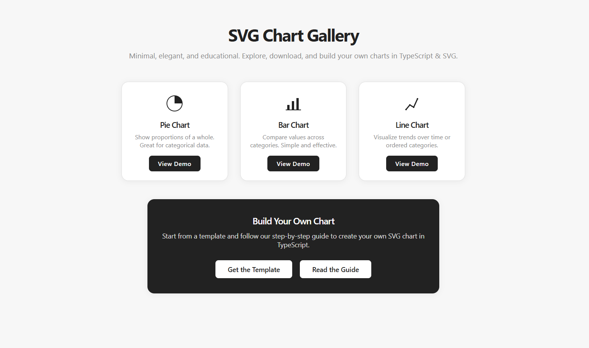
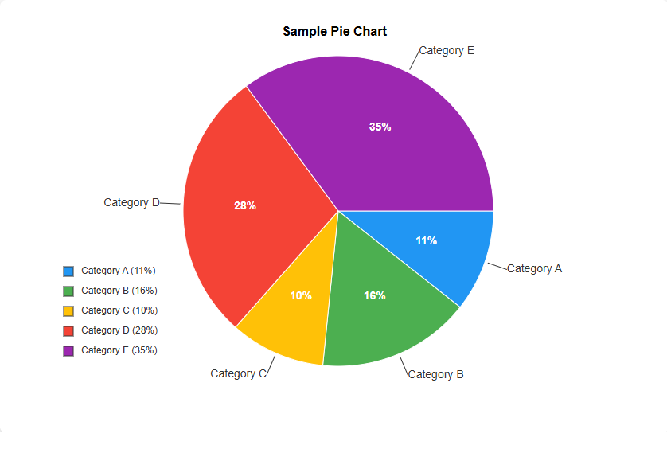
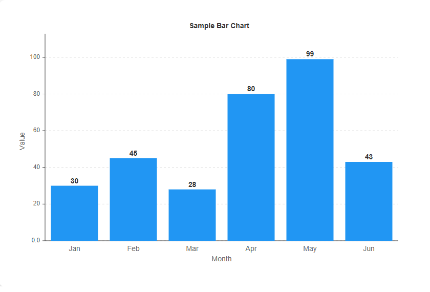
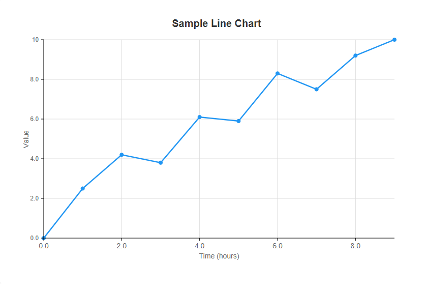

# TypeScript SVG Chart Gallery

[Live Demo on Vercel](https://type-chart-svg.vercel.app/)

_Elegant, educational, and minimal charting library and gallery in TypeScript + SVG._



## ✨ Features

- Pie, Bar, and Line charts (more coming!)
- Download SVGs with one click
- Beautiful, high-art black & white theme
- Step-by-step guide for building your own chart
- 100% TypeScript, no frameworks

## 🚀 Quick Start

1. Clone the repo:
   ```sh
   git clone https://github.com/TeodorIliev06/type-chart-svg.git
   cd type-chart-svg
   ```
2. Open `index.html` in your browser to view the gallery.

## 🖼️ Gallery Preview

| Pie Chart | Bar Chart | Line Chart |
|-----------|-----------|-----------|
|  |  |  |

## 📚 Build Your Own

- Start from the [template](examples/chart-template.html)
- Follow the [step-by-step guide](docs/guide.html)

## 📁 Project Structure

- `src/` - Chart library source code
- `examples/` - Example charts and templates
- `docs/` - Guide and documentation

## 🤝 Contributing

PRs and suggestions welcome!

## 📝 License

MIT

## Inspiration

This project was inspired by [attestate/svg-line-chart](https://github.com/attestate/svg-line-chart), a minimalist SVG chart generator library.
